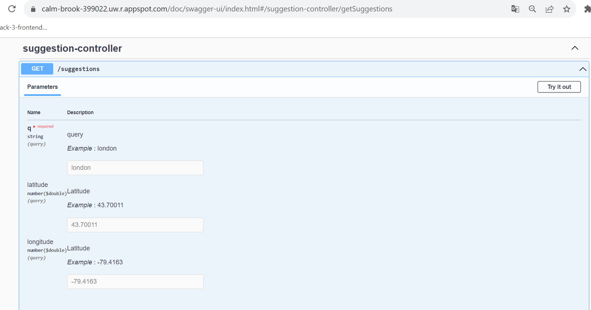

# Suggestions
### _Provides auto-complete suggestions for large cities_

## Features

- Import a HTML file and watch it magically convert to Markdown


Markdown is a lightweight markup language based on the formatting conventions
that people naturally use in email.
As [John Gruber] writes on the [Markdown site][df1]

> The overriding design goal for Markdown's
> formatting syntax is to make it as readable
> as possible. The idea is that a
> Markdown-formatted document should be
> publishable as-is, as plain text, without
> looking like it's been marked up with tags
> or formatting instructions.

This text you see here is *actually- written in Markdown! To get a feel
for Markdown's syntax, type some text into the left window and
watch the results in the right.

## Endpoint

## Using the API
You can access the API using the GET method at the following address:
```sh
http://calm-brook-399022.uw.r.appspot.com/suggestions
```
## Example Usage
You can make a sample request using the above address and providing optional parameters if needed:
```sh
http://calm-brook-399022.uw.r.appspot.com/suggestions?q=london&latitude=43.70011&longitude=-79.4163
```
The response should be the array with different suggestions matching the query send and order by distance shown as score. Also I added the id, because could be taken easily for the selection.
## Example response
The API returns a JSON response with an array of scored suggestions. Here is the response structure:
```json
{
    "suggestions": [
        {
            "id": 6058560,
            "name": "London",
            "latitude": 42.98339,
            "longitude": -81.23304,
            "score": 0.5983154207457454
        },
        //other suggestions ...
    ]
}
```
* Suggestions are sorted in descending order by score.
* Each suggestion has a score between 0 and 1, indicating confidence in the suggestion (1 is the most confident).
* Each suggestion includes a name that can be used to distinguish between similarly named locations.
* Each suggestion includes latitude and longitude representing the geographical location of the city.
## Access Swagger Documentation
Detailed documentation for this API is available in Swagger at the following URL:
http://calm-brook-399022.uw.r.appspot.com/doc/swagger-ui/index.html#/suggestion-controller/getSuggestions

### Required Parameters
* q: query
### Optional Parameters
The following optional parameters can be supplied in the query to improve suggestion accuracy:

* latitude: Latitude of the user's location.
* longitude: Longitude of the user's location.

We have the JavaDocs report in the following link: https://eduabundiz.github.io/suggestions/

This API is designed to provide suggestions. It is used with Spring Boot following the MVC pattern. The project structure is divided into:

* controller (Entry point)
* service (Business logic)
* repository (Data retrieval, in this case from the provided file)
* entity (Data model)

### Implementation
* You can check de method getFileCities in the class CitiesReaderRepository.
In this particular case, we are fetching data from the file only at the beginning of the application. The data is stored, providing quicker access for subsequent queries. It could be replaced with a database for a future implementation.
* To calculate the distance beetween the cities is implemented in a Util class DistanceUtils using the Haversine
* formula, because is the best options for these cases.
* Exceptions are created to response a 500 error if something happens in the service, and 400 error if the user sent invalid parameters.

